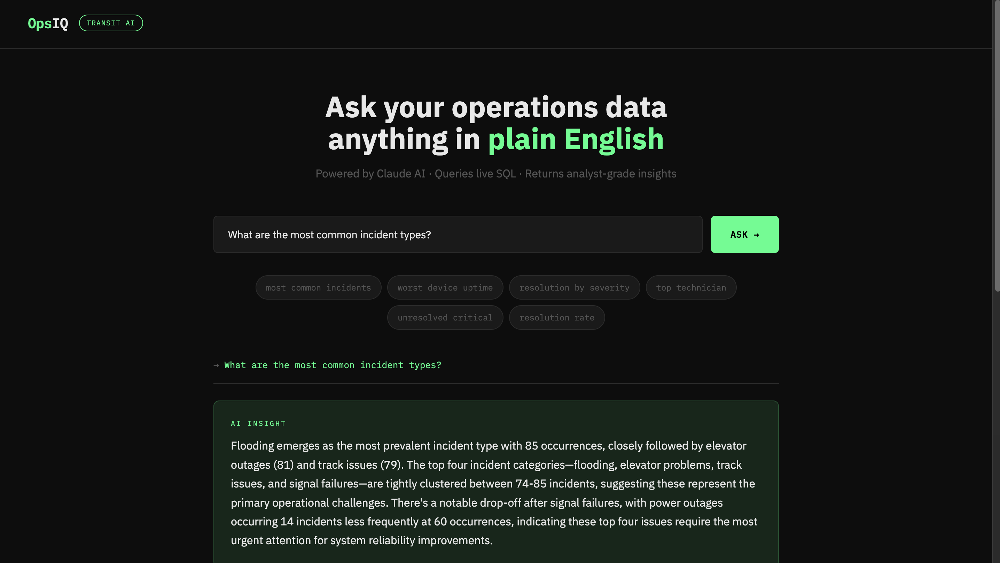

# OpsIQ — Transit Operations Intelligence Agent

> Ask your operations data anything in plain English. OpsIQ translates natural language questions into SQL, queries a live database, and returns analyst-grade insights — powered by Claude AI.



## What This Is

OpsIQ is a **Text-to-SQL AI agent** built for transit operations analytics. Instead of writing SQL queries or digging through dashboards, operators can ask questions like:

- *"Which station has the most unresolved incidents?"*
- *"What is the average resolution time for critical failures?"*
- *"Which technician completed the most maintenance tasks this month?"*

The agent handles the rest — generating SQL, querying the database, and returning a plain-English insight.

## How It Works
```
User Question (natural language)
        ↓
   Claude AI — generates SQL query
        ↓
   SQLite Database — executes query
        ↓
   Claude AI — explains results as insight
        ↓
   Human-readable answer + raw data table
```

This 3-step LLM chain pattern is the same architecture used in enterprise tools like Tableau AI and Power BI Copilot.

## Tech Stack

| Layer | Technology |
|-------|-----------|
| AI / LLM | Anthropic Claude (claude-sonnet) |
| Backend | Python, Flask |
| Database | SQLite (1,200+ rows of transit ops data) |
| Frontend | HTML, CSS, Vanilla JS |
| Key Libraries | `anthropic`, `python-dotenv`, `pandas` |

## Project Structure
```
opsiq/
├── app.py                 # Flask web server & API routes
├── agent/
│   └── sql_agent.py       # Core AI agent (Text-to-SQL chain)
├── database/
│   ├── seed.py            # Database creation & seeding
│   └── opsiq.db           # SQLite database (3 tables, 1,200 rows)
├── templates/
│   └── index.html         # Frontend UI
├── .env.example           # Environment variable template
└── requirements.txt       # Python dependencies
```

## Database Schema

**incidents** — 500 rows of transit incident records
- Tracks incident type, severity, resolution status, and time-to-resolve across 8 subway lines

**device_health** — 400 rows of device monitoring data
- Tracks uptime % and online/offline/degraded status for 6 device types across 10 stations

**maintenance** — 300 rows of maintenance activity
- Tracks technician assignments, task types, and completion status

## Getting Started

### Prerequisites
- Python 3.9+
- Anthropic API key ([get one here](https://console.anthropic.com))

### Installation
```bash
# Clone the repo
git clone https://github.com/YOUR_USERNAME/opsiq.git
cd opsiq

# Create virtual environment
python -m venv venv
source venv/bin/activate  # Windows: venv\Scripts\activate

# Install dependencies
pip install -r requirements.txt

# Set up environment variables
cp .env.example .env
# Edit .env and add your ANTHROPIC_API_KEY

# Seed the database
python database/seed.py

# Run the app
python app.py
```

Open [http://127.0.0.1:5001](http://127.0.0.1:5001) in your browser.

## Skills Demonstrated

- **LLM Chaining** — Multi-step Claude API calls with structured prompting
- **Text-to-SQL** — Natural language to executable SQL generation
- **AI Agent Design** — Prompt engineering, schema injection, output parsing
- **Full-Stack Development** — Flask REST API + responsive frontend
- **Data Engineering** — Realistic synthetic dataset design and SQLite management
- **Production Practices** — Environment variable management, error handling, `.gitignore`

## Background

This project was inspired by my work at the **Metropolitan Transportation Authority (MTA)**, where I built Python/SQL pipelines and Power BI dashboards for operational KPI tracking. OpsIQ represents the next evolution of that work — replacing manual dashboard queries with a conversational AI interface.

---

Built by [Moin Hasan](https://www.linkedin.com/in/moinhhasan/) · [LinkedIn](https://www.linkedin.com/in/moinhhasan/)
